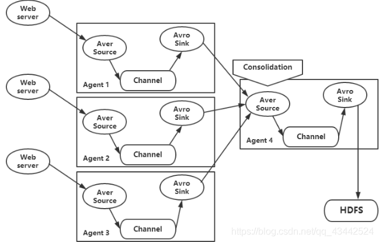
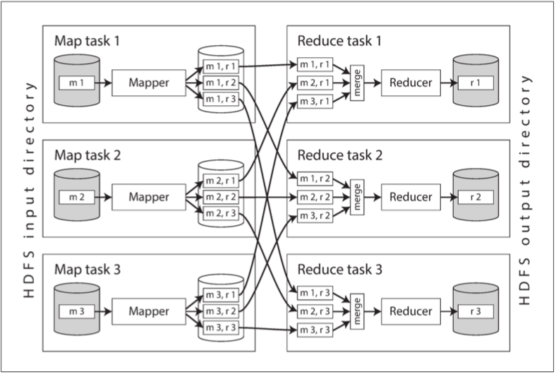
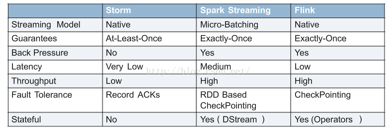
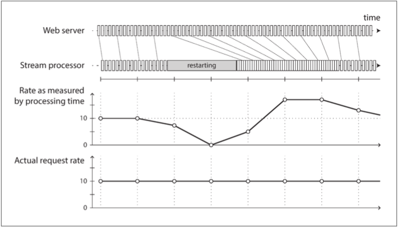
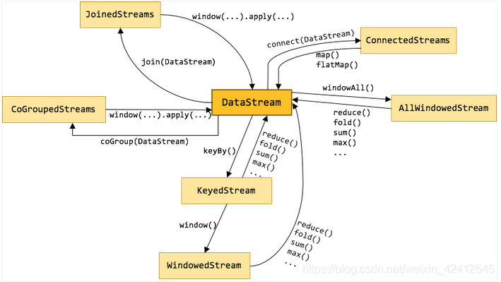

# flink


### 隐喻

记录系统（System of record） 记录系统，也被称为真相源（source of truth），持有数据的权威版本。当新的数据进入时（例如，用户输入）首先会记录在这里。每个事实正正好好表示一次（表示通常是标准化的（normalized））。如果其他系统和记录系统之间存在任何差异，那么记录系统中的值是正确的（根据定义）。 衍生数据系统（Derived data systems） 衍生系统中的数据，通常是另一个系统中的现有数据以某种方式进行转换或处理的结果。如果丢失衍生数据，可以从原始来源重新创建。典型的例子是缓存（cache）：如果数据在缓存中，就可以由缓存提供服务；如果缓存不包含所需数据，则降级由底层数据库提供。非规范化的值，索引和物化视图亦属此类。在推荐系统中，预测汇总数据通常衍生自用户日志。 从技术上讲，衍生数据是冗余的（redundant），因为它重复了已有的信息。但是衍生数据对于获得良好的只读查询性能通常是至关重要的。它通常是非规范化的。可以从单个源头衍生出多个不同的数据集，使你能从不同的“视角”洞察数据。 并不是所有的系统都在其架构中明确区分记录系统和衍生数据系统，但是这是一种有用的区分方式，因为它明确了系统中的数据流：系统的哪一部分具有哪些输入和哪些输出，以及它们如何相互依赖。 大多数数据库，存储引擎和查询语言，本质上既不是记录系统也不是衍生系统。数据库只是一个工具：如何使用它取决于你自己。记录系统和衍生数据系统之间的区别不在于工具，而在于应用程序中的使用方式。

#### 从一个管道命令开始

假设你想在你的网站上找到五个最受欢迎的网页

```
cat /var/log/nginx/access.log | #1
        awk '{print $7}' | #2
        sort               | #3
        uniq -c          | #4
        sort -r -n       | #5
        head -n 5       #6
```

1. 读取日志文件
2. 将每一行按空格分割成不同的字段，每行只输出第七个字段，恰好是请求的URL。在我们的例子中是/css/typography.css。
3. 按字母顺序排列请求的URL列表。如果某个URL被请求过n次，那么排序后，文件将包含连续重复出现n次的该URL。
4. uniq命令通过检查两个相邻的行是否相同来过滤掉输入中的重复行。 -c则表示还要输出一个计数器：对于每个不同的URL，它会报告输入中出现该URL的次数。
5. 第二种排序按每行起始处的数字（-n）排序，这是URL的请求次数。然后逆序（-r）返回结果，大的数字在前。
6. 最后，只输出前五行（-n 5），并丢弃其余的

#### 管道小插曲

**logstash**

input | decode | filter | encode | output

**flume**

********

#### 从管道到批处理(MR)

&#x20;MapReduce有点像Unix工具，但分布在数千台机器上。像Unix工具一样，它相当简单粗暴，但令人惊异地管用。一个MapReduce作业可以和一个Unix进程相类比：它接受一个或多个输入，并产生一个或多个输出。

1. 读取一组输入文件，并将其分解成记录（records）。在Web服务器日志示例中，每条记录都是日志中的一行（即\n是记录分隔符）。
2. 调用Mapper函数，从每条输入记录中提取一对键值。在前面的例子中，Mapper函数是awk '{print $7}'：它提取URL（$7）作为关键字，并将值留空。
3. 按键排序所有的键值对。在日志的例子中，这由第一个sort命令完成。
4. 调用Reducer函数遍历排序后的键值对。如果同一个键出现多次，排序使它们在列表中相邻，所以很容易组合这些值而不必在内存中保留很多状态。在前面的例子中，Reducer是由uniq -c命令实现的，该命令使用相同的键来统计相邻记录的数量。

********

**物化中间状态** **容错** **声明式查询语言** **资源容器化管理**

**ETL**

#### 从批处理到流处理(FLINK)

无界限的数据流

**复杂事件处理**

复合事件处理（complex, event processing, CEP） 是20世纪90年代为分析事件流而开发出的一种方法，尤其适用于需要搜索某些事件模式的应用。与正则表达式允许你在字符串中搜索特定字符模式的方式类似，CEP允许你指定规则以在流中搜索某些事件模式。 CEP系统通常使用高层次的声明式查询语言，比如SQL，或者图形用户界面，来描述应该检测到的事件模式。这些查询被提交给处理引擎，该引擎消费输入流，并在内部维护一个执行所需匹配的状态机。当发现匹配时，引擎发出一个复合事件（complex event）（因此得名），并附有检测到的事件模式详情。 在这些系统中，查询和数据之间的关系与普通数据库相比是颠倒的。通常情况下，数据库会持久存储数据，并将查询视为临时的：当查询进入时，数据库搜索与查询匹配的数据，然后在查询完成时丢掉查询。 CEP引擎反转了角色：查询是长期存储的，来自输入流的事件不断流过它们，搜索匹配事件模式的查询

**流分析**

使用流处理的另一个领域是对流进行分析。 CEP与流分析之间的边界是模糊的，但一般来说，分析往往对找出特定事件序列并不关心，而更关注大量事件上的聚合与统计指标 —— 例如： 测量某种类型事件的速率（每个时间间隔内发生的频率） 滚动计算一段时间窗口内某个值的平均值 将当前的统计值与先前的时间区间的值对比（例如，检测趋势，当指标与上周同比异常偏高或偏低时报警）

**FLINK SPARK JSTORM**

********

### FLINK 概念

#### 事件时间和处理时间

很多原因都可能导致处理延迟：排队，网络故障（参阅“不可靠的网络”），性能问题导致消息代理/消息处理器出现争用，流消费者重启，重新处理过去的事件（参阅“重放旧消息”），或者在修复代码BUG之后从故障中恢复。 而且，消息延迟还可能导致无法预测消息顺序。例如，假设用户首先发出一个Web请求（由Web服务器A处理），然后发出第二个请求（由服务器B处理）。 A和B发出描述它们所处理请求的事件，但是B的事件在A的事件发生之前到达消息代理。现在，流处理器将首先看到B事件，然后看到A事件，即使它们实际上是以相反的顺序发生的。&#x20;



#### 窗口类型

**滚动窗口（Tumbling Window）** 滚动窗口有着固定的长度，每个事件都仅能属于一个窗口。例如，假设你有一个1分钟的滚动窗口，则所有时间戳在10:03:00和10:03:59之间的事件会被分组到一个窗口中，10:04:00和10:04:59之间的事件被分组到下一个窗口，依此类推。通过将每个事件时间戳四舍五入至最近的分钟来确定它所属的窗口，可以实现1分钟的滚动窗口。 **跳动窗口（Hopping Window）** 跳动窗口也有着固定的长度，但允许窗口重叠以提供一些平滑。例如，一个带有1分钟跳跃步长的5分钟窗口将包含10:03:00至10:07:59之间的事件，而下一个窗口将覆盖10:04:00至10:08:59之间的事件，等等。通过首先计算1分钟的滚动窗口，然后在几个相邻窗口上进行聚合，可以实现这种跳动窗口。 **滑动窗口（Sliding Window）** 滑动窗口包含了彼此间距在特定时长内的所有事件。例如，一个5分钟的滑动窗口应当覆盖10:03:39和10:08:12的事件，因为它们相距不超过5分钟（注意滚动窗口与步长5分钟的跳动窗口可能不会把这两个事件分组到同一个窗口中，因为它们使用固定的边界）。通过维护一个按时间排序的事件缓冲区，并不断从窗口中移除过期的旧事件，可以实现滑动窗口。 **会话窗口（Session window）** 与其他窗口类型不同，会话窗口没有固定的持续时间，而定义为：将同一用户出现时间相近的所有事件分组在一起，而当用户一段时间没有活动时（例如，如果30分钟内没有事件）窗口结束。会话切分是网站分析的常见需求

#### 状态与checkpoint

有状态的函数和操作在处理各个元素或者事件时存储数据，使得state称为任何类型的复杂操作的关键构建部件,例如: 　　当一个应用程序搜索某些特定的事件模式时，状态会保存截止到目前为止遇到过的事件的顺序; 　　当每分钟聚合事件时，状态会保存挂起的聚合 　　当通过数据点来训练机器学习模型时，状态会保存当前版本的模型参数 为了使state容错，Flink需要识别state并checkpoint它, 在许多情况下，Flink还管理着应用程序的状态，这意味着Flink处理内存管理(如果需要，可能会将内存中的数据溢出到磁盘)来保存非常大的state。 在Flink中有两个基本的state：Keyed state和 Operator state

### FLINK API


**状态切换**&#x20;



```
stream
       .keyBy(...)               <-  keyed versus non-keyed windows
       .window(...)/.windowAll(...)  <-  required: "assigner"
      [.trigger(...)]            <-  optional: "trigger" (else default trigger)
      [.evictor(...)]            <-  optional: "evictor" (else no evictor)
      [.allowedLateness(...)]    <-  optional: "lateness" (else zero)
      [.sideOutputLateData(...)] <-  optional: "output tag" (else no side output for late data)
       .reduce/aggregate/fold/apply()      <-  required: "function"
      [.getSideOutput(...)]      <-  optional: "output tag"
```

#### source

#### sink

#### window trigger evictor

Trigger是一个抽象类，里面有几个非常重要的抽象方法： onElement()：进入窗口的每个元素都会调用该方法 onEventTime()：事件时间timer触发的时候被调用 onProcessingTime()：处理时间timer触发的时候会被调用 onMerge()：有状态的触发器相关，并在它们相应的窗口合并时合并两个触发器的状态，例如使用会话窗口 clear()：在窗口销毁时调用（窗口结束期加上最大延迟时间） 另外可以看到还有一个重要的返回类型TriggerResult：

CONTINUE：什么都不做 FIRE：触发计算 PURE：清除窗口的元素 FIRE\_AND\_PURE：触发计算和清除窗口元素

#### join


### FLINK Table API / SQL

#### UDF

一行转一行

#### UDAF

多行转一行

#### UDTF

一行转多行 一列转多列

### 压测的日志合并程序问题分析

**改造前**

```
ZorkLogData2EsSink zorkLogData2EsSink = new ZorkLogData2EsSink();
        ElasticsearchSink elasticsearchSink = zorkLogData2EsSink.getElasticsearchSink(conf);
        DataStreamSource<ZorkLogData> streamSource = env.addSource(kafkaConsumer08);
        streamSource
                .filter(new CommonFilterFunction(sourceCommonLogTypeName))
                // 设置水位线
                .assignTimestampsAndWatermarks(new AssignerWithPeriodicWatermarks<ZorkLogData>() {
                    // 达到 source 节点的最大延迟时间
                    long maxOutOfOrderness = Long.valueOf(watermarks);
                    long currentMaxTimestamp = 0L;
                    long problemData = Long.valueOf(problemDate);
                    long lastEmittedWatermark = Long.MIN_VALUE;

                    @Override
                    public long extractTimestamp(ZorkLogData element, long previousElementTimestamp) {

                        long timestamp = DateUtil.timestamp(element.getTimestamp());
                        // currentMaxTimestamp 计算最大时间戳
                        if (currentMaxTimestamp == 0 || (timestamp - currentMaxTimestamp < problemData)) {
                            currentMaxTimestamp = Math.max(timestamp, currentMaxTimestamp);
                        } else {
                            currentMaxTimestamp = currentMaxTimestamp + problemData;
                            System.out.println("异常数据");
                        }
                        return currentMaxTimestamp;
                    }

                    /**
                     * 发射水印
                     * @return
                     */
                    @Nullable
                    @Override
                    public Watermark getCurrentWatermark() {
                        // 允许延迟 maxOutOfOrderness
                        long potentialWM = currentMaxTimestamp - maxOutOfOrderness;
                        // 保证水印依次递增
                        if (potentialWM >= lastEmittedWatermark) {
                            lastEmittedWatermark = potentialWM;
                        }
                        // 水印时间设置为时间最大时间减去延迟时间(发射时间落差为延迟时间)
                        return new Watermark(lastEmittedWatermark);
                    }
                }).setParallelism(1)
                // 根据keyField值分组
                .keyBy(new CommonKeySelector(keyByFields))
                // 设置事件时间会话窗口
                .window(EventTimeSessionWindows.withGap(Time.milliseconds(Long.valueOf(String.valueOf(window)))))
                .allowedLateness(Time.minutes(windowAllowedLateness))
                // 计算窗口 国信金太阳业务和通达信的合并逻辑是一样的,共用一个
                .apply(new JTYLogWindowFunction(logTypeName, logReqSuffix, logRespSuffix))
                .addSink(elasticsearchSink).name(sinkName);
```

***

**改造后**

```
 ZorkLogData2EsSink zorkLogData2EsSink = new ZorkLogData2EsSink();
        ElasticsearchSink elasticsearchSink = zorkLogData2EsSink.getElasticsearchSink(conf);
        DataStreamSource<ZorkLogData> streamSource = env.addSource(kafkaConsumer08);
        streamSource
                .filter(new CommonFilterFunction(sourceCommonLogTypeName))
                // 根据keyField值分组
                .keyBy(new CommonKeySelector(keyByFields))
                .window(ProcessingTimeSessionWindows.withGap(Time.milliseconds(Long.valueOf(String.valueOf(window)))))
                .trigger(new CountTriggerTimeout<ZorkLogData>(2, TimeCharacteristic.ProcessingTime))
                .allowedLateness(Time.minutes(windowAllowedLateness))
                // 计算窗口 国信金太阳业务和通达信的合并逻辑是一样的,共用一个
                .apply(new JTYLogWindowFunction(logTypeName, logReqSuffix, logRespSuffix))
                .setParallelism(16)
                .addSink(elasticsearchSink).name(sinkName);
```

**trgger 与 状态**


****

****
